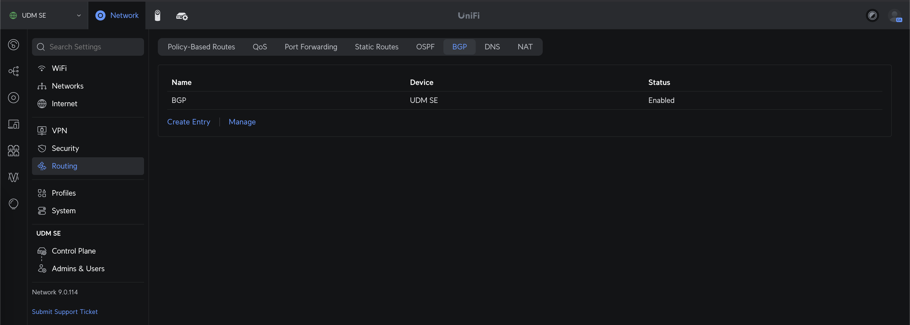

# FRR BGP Configuration for UnifiOS
bgp.conf - FRR BGP Configuration file

## Upload the configuration
#### Go to Settings -> Routing -> BGP
Create an entry, give it a name and upload the configuration file

For some reason it wasn't enough to just upload the configuration file. I had to set ***bgpd=yes*** in ***/etc/frr/daemons*** and then start the service by running ***/usr/sbin/frrinit.sh start***

---

## Useful commands for troubleshooting
#### NB. Use SSH to access the console of your unifi device

`vtysh -c "show ip route"` - Shows routing table

`vtysh -c "show ip bgp prefix-list lan-networks"` - Shows content of prefix list named ***lan-networks***

`vtysh -c "show ip bgp route-map lan"` - Shows content of route map named ***lan***

`vtysh -c "show ip bgp neighbor 10.2.0.2 advertised-routes"` - Shows the routes being advertised to neighbor ***10.2.0.2***

`vtysh -c "show ip bgp neighbors 10.2.0.2 received-routes"` - Shows the routes received from neighbor ***10.2.0.2***

`vtysh -c "show ip route 192.168.1.0/24"` - Shows details for a specific route. in this case the route to network ***192.168.1.0/24***
